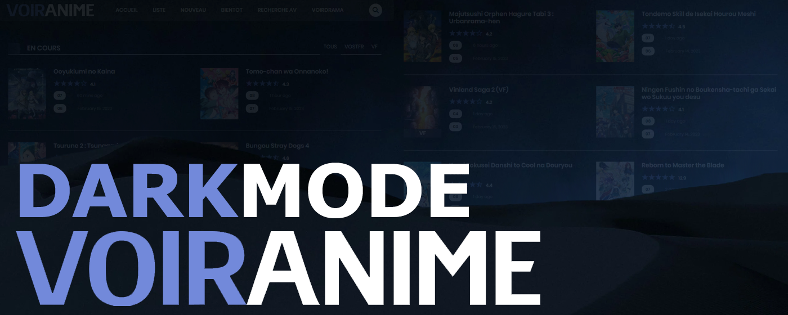

# VoirAnime DarkMod
**Thème sombre, AdBlock et bien plus pour tout le site [VoirAnime](https://voiranime.com/).**

**VoirAnime DarkMod** applique un thème sombre homogène et nettoie l’interface du site [VoirAnime](https://voiranime.com/) afin d’offrir une expérience de visionnage plus confortable.

## Fonctionnalités
- **Thème sombre** appliqué à l’ensemble du site.
- **Blocage d’annonces** supprimant la majorité des publicités intégrées.
- **Interface épurée** : éléments dupliqués ou superflus retirés.
- **Commentaires masqués** pour éviter les spoilers.

> Des pop-ups peuvent néanmoins apparaître lors de la lecture d’épisodes.  
> Pour une protection maximale, combinez l’extension avec un bloqueur de contenus  
> tel que **[uBlock Origin](https://chromewebstore.google.com/detail/ublock-origin/cjpalhdlnbpafiamejdnhcphjbkeiagm)**.

\* L’extension se limite à modifier le CSS de VoirAnime ; elle n’altère ni ne stocke le contenu du site.

## Installation
1. Ouvrez la page de l’extension sur le **[Chrome Web Store](https://chromewebstore.google.com/detail/dckaidelfhmapnkeejdihjbdbafckelh)**.
2. Cliquez sur **Ajouter à Chrome** puis confirmez.

## Contribuer
Les contributions sont bienvenues !
- Signalez un bug ou proposez une amélioration via l’onglet **Issues**.
- Soumettez une **pull request** pour corriger du code ou ajouter une fonctionnalité.

Merci de respecter le *Code de conduite* et les modèles d’issues fournis dans le dépôt.

## Licence
Ce projet est distribué sous licence **GNU GPL v3**.  
Vous pouvez l’utiliser, le modifier et le redistribuer sous réserve de respecter les termes de la licence GNU General Public License, version 3.

Pour plus d’informations, consultez le texte complet ici : [GNU GPL v3](https://www.gnu.org/licenses/gpl-3.0.html).

## Remerciements
- **[VoirAnime](https://voiranime.com/)** pour son contenu.
- **[Oriloo](https://github.com/Oriloo)** pour le développement de l’extension.

© 2023-2025 **[Oriloo](https://github.com/Oriloo)** — Projet non affilié à VoirAnime.
