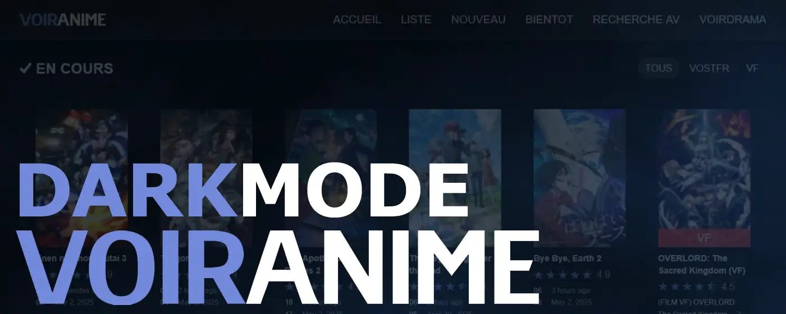

# VoirAnime DarkMod
**Thème sombre et bien plus pour tout le site [VoirAnime](https://voiranime.com/).**

 

**VoirAnime DarkMod** est une extension pour [VoirAnime](https://voiranime.com/) permettant de personnaliser l’apparence du site (thème sombre/clair, modules CSS modulaires, etc.).

## 🚀 Nouveautés de la v2.0.0

* Refonte complète de l’architecture CSS en modules séparés (`variables`, `header`, `content`, `footer`, etc.).
* Ajout du thème clair (`.theme-light`) en plus du thème sombre.
* Menu de configuration enrichi dans le popup (activation/désactivation, choix de version CSS, affichage de la barre de recherche).
* Support de deux versions de styles : **v2.0.0** (new) et **v1.2.0** (old).
* Amélioration des performances et de la maintenabilité du code.

## ⚙️ Fonctionnalités

1. **Thèmes**
    * Thème sombre homogène sur tout le site.
    * Thème clair optionnel via la classe `.theme-light`.
   
2. **Versions CSS**
    * v2.0.0 : architecture modulaire, variables globales.
    * v1.2.0 : version legacy unique (pour compatibilité).
   
3. **Interface de configuration** (popup)
    * Activation/désactivation de l’extension.
    * Sélecteur de thème (sombre / clair).
    * Choix de version CSS (v2.0.0 / v1.2.0).
    * Affichage ou masquage de la barre de recherche.
   
4. **Modules CSS**
    * `variables.css` : palette de couleurs, typographies, breakpoints.
    * `general.css`, `header.css`, `content.css`, `footer.css`, `pagination.css`, etc., pour chaque section et page.
   
5. **Injection dynamique**
    * Utilisation de `chrome.storage` pour conserver les préférences.
    * Injection/retrait de CSS via `chrome.scripting` dès le `document_start`.

## 📦 Installation

Ouvrez la page de l’extension sur le **[Chrome Web Store](https://chromewebstore.google.com/detail/dckaidelfhmapnkeejdihjbdbafckelh)** ou sur le **[Firefox Add-ons](https://addons.mozilla.org/firefox/addon/voiranime-darkmod/)**.
 
Aussi disponible sur Android via l'aplication **Kiwi Browser** ou **Firefox**.

> Des pop-ups peuvent apparaître lors de la lecture d’épisodes.  
> Pour une protection maximale, combinez l’extension avec un bloqueur de contenus  
> tel que **[uBlock Origin](https://chromewebstore.google.com/detail/ublock-origin/cjpalhdlnbpafiamejdnhcphjbkeiagm)**.

### Pour les développeurs
1. Clonez ou téléchargez cette extension.
2. Ouvrez `chrome://extensions/` (ou `about:debugging#/runtime/this-firefox` sous Firefox).
3. Activez le **Mode développeur**.
4. Cliquez sur **Charger l’extension non empaquetée** et sélectionnez le dossier du projet.

## 📝 Utilisation

1. Cliquez sur l’icône de l’extension dans la barre d’outils.
2. Dans le popup, configurez : thème, version CSS, barre de recherche.

## 🛠️ Personnalisation avancée

* Modifiez les variables globales dans `versions/v200/variables.css`.
* Ajoutez ou ajustez des styles dans les modules CSS correspondant aux pages.
* Étendez `popup.js` pour de nouvelles options de configuration.

## 📝 Changelog

### v2.0.0 (2025-05-08)

* Architecture CSS entièrement modulaire.
* Ajout du thème clair.
* Popup de configuration amélioré.
* Support de la version legacy v1.2.0.

### v1.2.0 (2023 2024)

* \[Anciennes fonctionnalités...]

## 🤝 Contribuer

Les contributions sont les bienvenues !

1. Forkez le dépôt.
2. Créez une branche (`git checkout -b feat/ma-fonctionnalité`).
3. Committez vos modifications (`git commit -m 'feat: nouvelle fonctionnalité'`).
4. Poussez vers la branche (`git push origin feature/ma-fonctionnalité`).
5. Ouvrez une pull request.

Merci de respecter le [Code de conduite](CODE_OF_CONDUCT.md).

## 📄 Licence

Ce projet est sous licence **GNU GPL v3**. Pour plus de détails, consultez [GPLv3](https://www.gnu.org/licenses/gpl-3.0.html).

## 🙏 Remerciements

* **[VoirAnime](https://voiranime.com/)** pour son contenu.
* **[Oriloo](https://github.com/Oriloo)** pour le développement initial.

© 2023-2025 **Oriloo** — Projet non affilié à VoirAnime.
